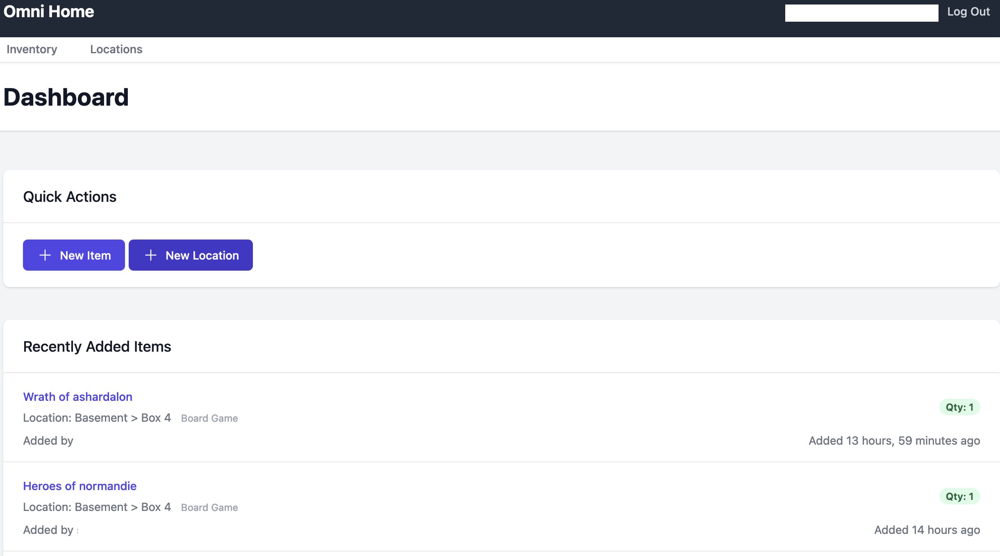
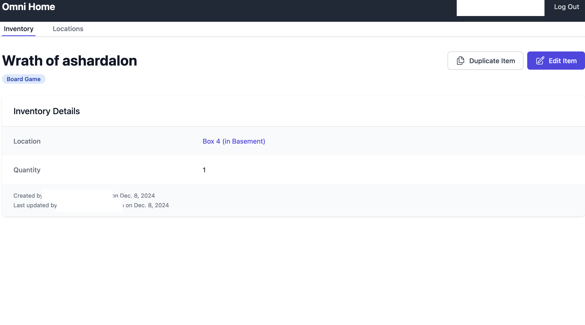
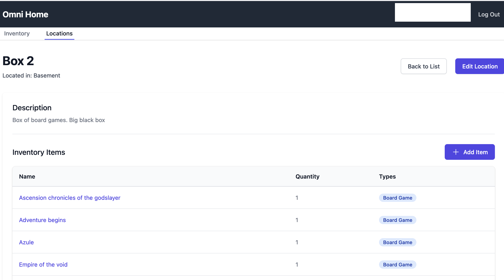

# Omni Home
This is a Django application that allows you to manage your home inventory, other features are planned such as:
- Home maintenance tracking
- Calendar Sync

Currently this is a work in progress and not all features are available. It's also not very easy to deploy as it's really tailored to my personal use case.


## Inventory
Currently inventory is the main feature. It allows you to track items in your home, including:
- Quantity
- Location
- Types (e.g. electronics, kitchenware, etc.)


## Locations
Locations are used to track where items are located in your home. They can be nested to allow for complex home structures. An example of a location structure might be:
```
Home
    Kitchen
        Fridge
        Pantry
    Living Room
        Couch
    Basement
        Storage
            Box 1
            Box 2  
```

# Installation
If you're interested in running this yourself, I'd be happy to help! A general guide is:
1. Clone the repository
2. Install dependencies
    - Uses [uv](https://github.com/astral-sh/uv) for python and virtual environment management. To install use `uv install`.
3. Run the development server: `python manage.py runserver`
4. Profit!


# Screenshots



